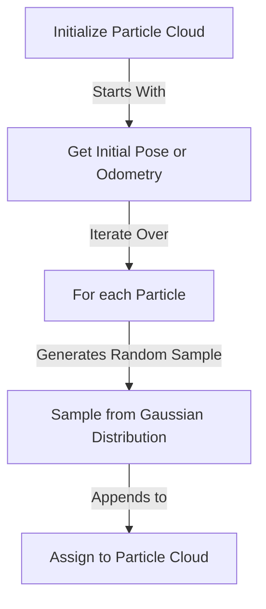
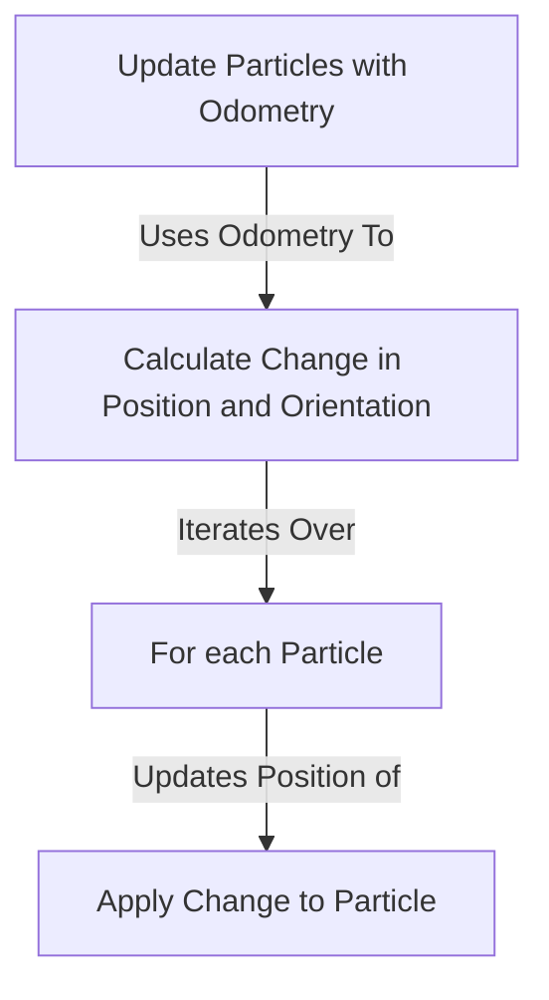
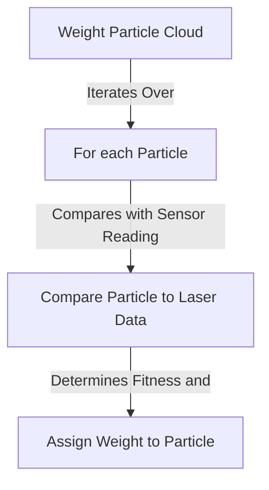
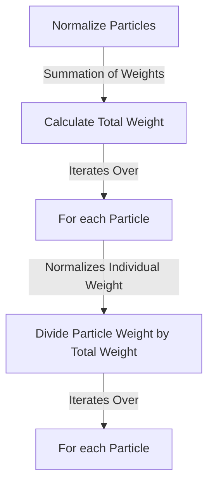
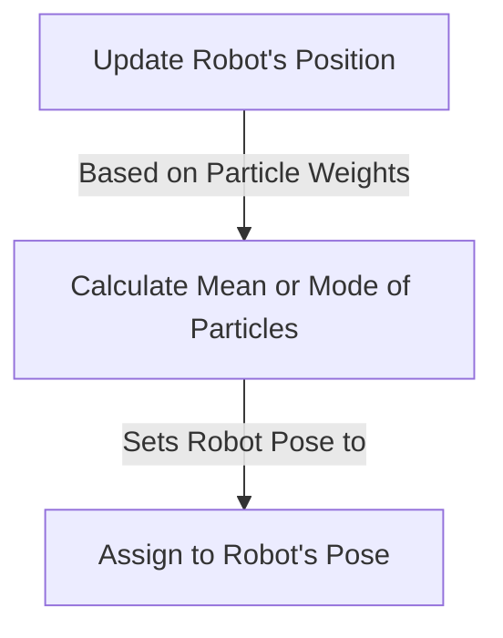
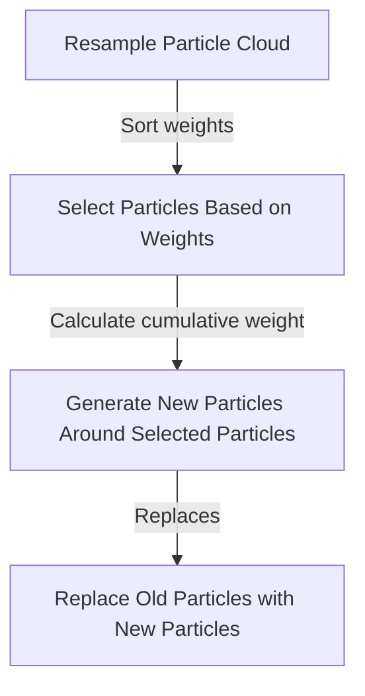

<!--- 
* What was the goal of your project?
* How did you solve the problem? (Note: this doesn’t have to be super-detailed, you should try to explain what you did at a high-level so that others in the class could reasonably understand what you did).
* Describe a design decision you had to make when working on your project and what you ultimately did (and why)? These design decisions could be particular choices for how you implemented some part of an algorithm or perhaps a decision regarding which of two external packages to use in your project.
* What if any challenges did you face along the way?
* What would you do to improve your project if you had more time?
* Did you learn any interesting lessons for future robotic programming projects? These could relate to working on robotics projects in teams, working on more open-ended (and longer term) problems, or any other relevant topic.
-->

# Robot Localization Project Report

### Introduction
This is the final product from a project for Computational Robotics at Olin College of Engineering where we had to implement parts of a particle filter. Provided with a map and ROS2 bag files of a Neato robot navigating in the mapped environment, we needed to localize the robot using a particle filter. We were given a template to work from that had the basic structure of the particle filter, as well as some helper functions, but we had 6 steps we need to implement ourselves: 
* Initializing the particle cloud
* Updating the particle locations with odometry data.
* Weighting the particle cloud
* Normalizing the particles
* Updating the robot's position from the weighted particle cloud
* Resampling the particle cloud

This writeup will include high-level overviews to our implementations of these functions, explain our design decisions, describe some challenges we had along the way, share some improvements that could be made, and reflect on interesting lessons we learned while working on this project that we hope to use in our future endeavours into robot localization and mapping.

### Particle Filter Implementation

The Particle Filter implementation in the code is based on the ROS2 framework. It leverages the `rclpy.Node` class from ROS2 to create a custom node named "pf" (short for Particle Filter). This node subscribes to sensor data (in this case, laser scans) and updates a cloud of particles that represents the possible poses (positions and orientations) of the robot within a known map. 

Here's a flowchart that illustrates the structure of the Particle Filter node:

**Design Decisions:**
- The Particle Filter uses a separate thread (`loop_wrapper`) to repeatedly call the main `run_loop`, bypassing the single-threaded execution limitation of ROS2. This ensures timely processing of data and updates.
- The Particle Filter uses an occupancy field (`OccupancyField`) to query the map for the distance to the closest obstacle. This assists in weighting the particles based on the laser scan data.
  
**Potential Challenges:**
- Thread safety: Using threads can introduce race conditions, especially when accessing shared resources like the particle cloud. A race condition is an undesirable situation that occurs when a device or system attempts to perform two or more operations at the same time, but because of the nature of the device or system, the operations must be done in the proper sequence to be done correctly.
- Over-reliance on laser data can lead to issues if the laser sensor malfunctions or if there's noise in the data.
  
**Possible Improvements:**
- Implement sensor fusion by integrating data from other sensors, not just the laser.
- Use a more advanced resampling algorithm to improve the efficiency of the particle filter.

### Initializing the particle cloud

The particle cloud is initialized around a given pose or the current odometry. Particles are spread around this pose using Gaussian distributions to account for the uncertainty in the initial pose. Two Gaussians are used, one for x and y position, and one for angle. <!-- Is the next sentence really nescessary? --> 
In our case, the standard deviation of the Gaussians is tuned so most particles are within a 1 meter square of the given position ($\sigma=\frac{1}{6}m$) and within 45 degrees of the given angle ($\sigma=\frac{\pi}{12}rad$).

**Design Decisions:**
- Gaussian distribution is used to spread particles around the initial pose to represent the uncertainty in the robot's starting position.
- Given pose is assumed to be accurate to +-0.5 meter and +-45 degrees.
  
**Potential Challenges:**
- If the initial pose is inaccurate, the particle filter may take longer to converge to the correct pose.
- Accuracy of given pose depends on the scale and the user.
  
**Possible Improvements:**
- Using additional sensors or external systems (like a GPS or markers) to provide a more accurate initial pose.
- Allowing user to give an accuracy/certainty value.

### Updating the particle locations with odometry data

The particles are updated based on the movement of the robot as indicated by odometry data. The change in position and orientation is calculated and applied to each particle.

**Design Decisions:**
- The use of odometry data helps in predicting the movement of particles between sensor updates. This prediction step is crucial in particle filter algorithms.
  
**Potential Challenges:**
- Odometry data can accumulate errors over time, leading to drift.
  
**Possible Improvements:**
- Implementing a sensor fusion approach to combine data from multiple sources and reduce reliance on odometry.

### Weighting the particle cloud

Particles are weighted based on how well they align with the sensor (laser) data. The closer a particle's predicted measurements are to the actual sensor measurements, the higher its weight.

**Design Decisions:**
- Weighting is essential to determine which particles are more likely to represent the robot's true position.
  
**Potential Challenges:**
- If the environment changes (e.g., an object moves), the weights might be inaccurate because the map doesn't reflect the current environment.
  
**Possible Improvements:**
- Implement adaptive algorithms that can handle dynamic environments.

### Normalizing the particles

After weighting the particles, their weights are normalized so that they sum up to 1. This makes the weights represent probabilities. This is done by dividing each particle's weight by the total weight of all of the particles.

### Updating the robot's position from the weighted particle cloud

The robot's estimated position is updated based on the weighted particles. This can be the mean of the particles or the position of the particle with the highest weight.

**Design Decisions:**
- Using the mean provides a smoother estimate, while using the mode (highest weight) may be more accurate if there's a clear peak in the particle weights.

### Resampling the particle cloud

Particles are resampled to focus on regions with higher densities. This step ensures that particles representing unlikely positions are discarded and replaced with particles near more probable positions. This is done by keeping the <!--This number might need to be changed-->25% of particles with the highest weights, then sampling a new particle cloud based on those 'good' particles. For each new particle, an old particle is randomly selected from the 'good' particles, with higher weights being preferred, and the new particle's `x`, `y`, and `theta` are selected using Gaussian distributions centered on the selected old particle. This is similar to how the particles are initialized, except with a smaller standard deviation for both distributions. 

**Design Decisions:**
- New particles are sampled from multiple old particles, simulating a multimodal distribution, allowing multiple  states to be kept at once.

**Potential Challenges:**
- If there are many possible states (roughly $0.25*n_{particles}$ or more), then not all possible states will be preserved.

**Possible Improvements:**
- Changes number of particles to sample from adaptively
- There are many other approaches, and this may not be the best one.

### Conclusion
Particle filters are excellent learning tools due to their ability to function at their crudest. Throughout our journey on this project, we delved deeply into the intricacies of the particle filter — a quintessential algorithm in robot localization. From the initial stages of particle cloud initialization to the serpentine process of resampling, each step was a learning experience in robotics software design. While the template provided an excellent scaffold, our team's imprint lies in the design decisions, the strategies employed to overcome challenges, and the refined localization ability. As we look forward to our future endeavors in robot localization and mapping, the insights gleaned from this project will undoubtedly serve as a guiding light, reminding us of the complex dance between theory and application, precision and adaptability, and problem and solution.
